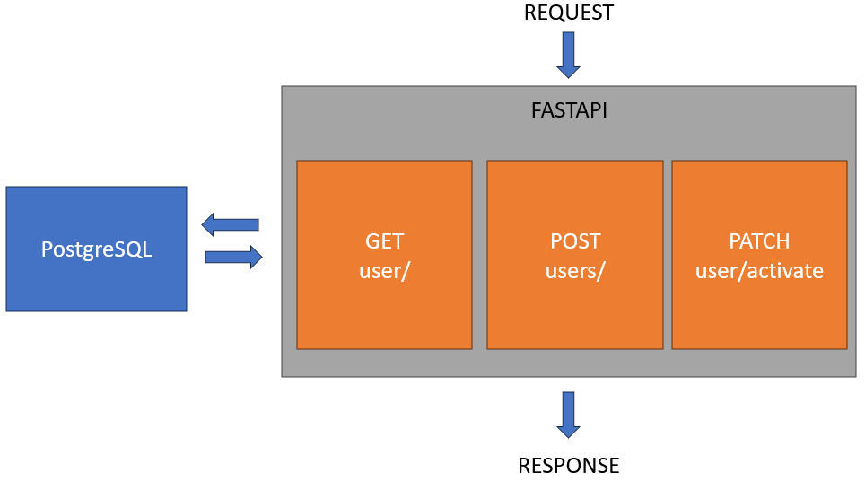

# Overview

This API is used to create and activate users

## Technologies used
- FastAPI
- uvicorn
- psycopg2
- PostgreSQL
- Docker

## Features
- Create users with email and password.
- Generate a 4 digits code for activation with a 1 minute activation period sent by mail.
- Activate users.

# Usage

To launch the app, simply type these commands at the root folder of the project:

```
docker compose pull
docker compose up -d
```

## Using with Swagger

Then go to [http://localhost:8000/docs#](http://localhost:8000/docs#)

## Using with CURL

The following section shows you how to use the API with CURL.

### Create a user

```
curl -X 'POST' \
  'http://localhost:8000/users' \
  -H 'accept: application/json' \
  -H 'Content-Type: application/json' \
  -d '{
  "email": "myuser@test.com",
  "password": "mypassword"
}'
```

### Get a user

```
curl -X 'GET' --user myuser@test.com:mypassword \
  'http://localhost:8000/user/1' \
  -H 'accept: application/json'
```

### Activate a user

```
curl -X 'PATCH' --user myuser@test.com:mypassword \
  'http://localhost:8000/users/activate/1?code=0000' \
  -H 'accept: application/json'
```

> You can get the code in the logs of the running container:
```
docker attach [id-of-docker-container]
```

## Run tests

To run tests, execute the following commands:

```
docker ps
docker exec -it [id-of-docker-container] bash
pytest app/
```

# Schema


